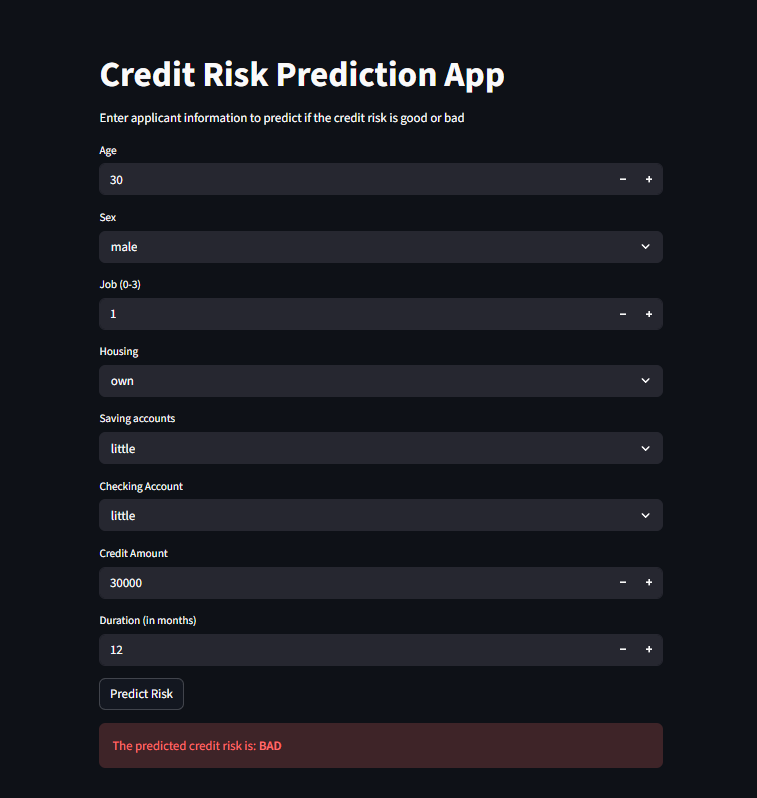

# 🏦 ML-Driven Strategic Credit Risk Prediction App

### **Live Application**
🔗 **[Launch Credit Risk Audit Tool](https://credit-risk-audit-app-yxzd8ie4nwn2ci9bopzpp5.streamlit.app/)**

---

### **Project Headline**
[cite_start]A high-fidelity **Machine Learning** diagnostic tool designed to predict credit default risk—focusing on applicant demographics, financial health, and historical lending patterns to ensure bank-grade portfolio security[cite: 2, 4].

---

### **Short Description / Purpose**
[cite_start]The **ML-Driven Credit Risk Prediction App** is an interactive analytical tool built to help financial institutions instantly evaluate the risk level of loan applicants[cite: 5, 6]. [cite_start]By processing historical records, it identifies whether an applicant poses a "Good" or "Bad" risk based on critical factors like savings, housing status, and duration of credit[cite: 7].

[cite_start]This tool is intended for use by **Credit Risk Analysts**, **Financial Auditors**, and **Data-Driven Strategists** who seek to automate risk assessment and minimize revenue leakage due to payment defaults[cite: 8].

---

### **🛠️ Tech Stack & Methodology**
[cite_start]The predictive engine and dashboard were built using a professional-grade data science stack, following a full end-to-end ML pipeline[cite: 9, 10]:

#### **Machine Learning & Intelligence**
* [cite_start]🧠 **Extra Trees Classifier** – Selected as the primary algorithm for its superior ability to handle high-dimensional credit data and reduce variance[cite: 13].
* 🧪 **Scikit-Learn** – The foundational framework used for data splitting, feature engineering, and model evaluation.
* 🔥 **XGBoost** – Implemented during the model selection phase to benchmark Gradient Boosting performance against forest-based methods.

#### **Data Engineering & Processing**
* [cite_start]📂 **Pandas & NumPy** – Used for the data transformation layer, including handling missing values and structural audits[cite: 11, 12].
* 📝 **Label Encoding** – Used to transform categorical strings (Sex, Housing, etc.) into a machine-readable format while preserving data integrity.
* 💾 **Joblib** – Facilitated model persistence by serializing the trained model and four distinct encoders for real-time production inference.

#### **Deployment & UI/UX**
* [cite_start]🌐 **Streamlit** – Used to build the front-end interface, allowing non-technical users to interact with the ML model through intuitive widgets[cite: 11].
* ☁️ **Streamlit Community Cloud** – The production environment hosting the live, publicly accessible web application.
* 🐙 **GitHub Desktop** – Leveraged for version control and CI/CD to push updates from local development to the cloud.

---

### **Data Source**
* [cite_start]**Source**: UCI Machine Learning Repository (Statlog German Credit Data)[cite: 16, 19].
* [cite_start]**Details**: Data on ~1,000 credit applicants, including details on their demographic location, housing, savings levels, and credit history[cite: 20].

---

### **Business Case & Insights**

#### **Business Problem**
[cite_start]The global lending industry generates billions in revenue, yet analysts often lack an intuitive way to predict defaults quickly from raw data[cite: 27, 28]. [cite_start]Identifying which applicant profiles represent the highest risk is difficult to answer without automated, data-driven tools[cite: 29, 33].

#### **Goal of the Dashboard**
[cite_start]To deliver an interactive visual tool that[cite: 34, 35]:
* [cite_start]Enables users to explore applicant risk profiles instantly[cite: 36].
* [cite_start]Supports critical decisions such as loan approval or financial infrastructure investment[cite: 37].
* [cite_start]Uncovers trends in financial accessibility and default capacity across different demographics[cite: 38].

#### **Walkthrough of Key Visuals**
* [cite_start]**Predictive Input Panel**: Interactive slicers and number inputs let users enter applicant data like Age, Sex, and Job level[cite: 40, 48].
* [cite_start]**Financial Attribute Selectors**: Dropdown menus for "Saving accounts" and "Checking account" levels to test financial stability[cite: 16, 17].
* [cite_start]**Risk Result (KPI)**: A dynamic alert system that displays a clear **"GOOD" (Green)** or **"BAD" (Red)** risk assessment based on the ML model's prediction[cite: 41].

#### **Business Impact & Insights**
* [cite_start]**Risk Management**: Identifies high-risk "Bad" profiles to protect bank capital and reduce NPAs[cite: 68].
* [cite_start]**Operational Efficiency**: Automates the manual audit process, allowing for faster loan processing times[cite: 65].
* [cite_start]**Strategic Expansion**: Helps institutions spot low-risk segments for targeted credit product marketing[cite: 66].

---

### **Screenshots / Demos**

